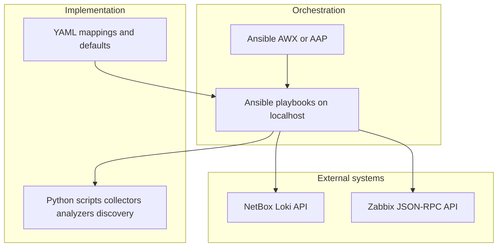

# Module: project-zabake (HMDL)

## Role

**Host Metadata-Driven Lifecycle (HMDL)**: automation between **Zabbix**, **NetBox (Loki)**, and the **Datalake** platform — configuration sync, inventory alignment, and monitoring-related definitions. Primary tooling: **Ansible** playbooks, typically scheduled or run from **AWX / Ansible Automation Platform (AAP)**. Deep technical detail stays in the module tree; this page is an **orientation map** per [ADR-0002](../adrs/ADR-0002-wiki-authoritative-docs-in-module-repos.md).

## Architecture (summary)

HMDL does not replace Zabbix or NetBox; it **drives** them via APIs using repeatable playbooks and YAML configuration. Python supports discovery, collectors, and notification helpers where needed.

- **NetBox → Zabbix**: devices and platforms from NetBox are reconciled with Zabbix hosts using mapping files under `zabbix-netbox/mappings/`.
- **Monitoring checks**: the supported path is **tag-based connectivity** (items tagged in Zabbix); see `zabbix-monitoring/`.
- **Legacy**: older platform sync, datalake file handoff, and CSV import live under `legacy/` and are not the preferred extension point.

Operational note: there is **no** `project-zabake/.github/workflows` in this monorepo; automation is expected to run via **AWX job templates**, `ansible-playbook`, or your org CI — not via a dedicated GitHub Actions pipeline in this folder.

## Automation inventory

Top-level playbook entry points (repository snapshot). Roles contain additional `tasks/*.yml` files.

| Path | Purpose | How it is usually run | Authoritative doc |
|------|---------|----------------------|---------------------|
| [zabbix-netbox/playbooks/netbox_zabbix_sync.yaml](../../project-zabake/zabbix-netbox/playbooks/netbox_zabbix_sync.yaml) | Sync NetBox devices/platforms to Zabbix; optional email on failures | `ansible-playbook` with `-e` for NetBox + Zabbix credentials; or AWX with credentials + extra vars | [zabbix-netbox/README.md](../../project-zabake/zabbix-netbox/README.md), [AWX_GUIDE.md](../../project-zabake/zabbix-netbox/docs/guides/AWX_GUIDE.md) |
| [zabbix-monitoring/playbooks/zabbix_tag_based_monitoring.yaml](../../project-zabake/zabbix-monitoring/playbooks/zabbix_tag_based_monitoring.yaml) | Tag-based connectivity scoring and email reports | `ansible-playbook` or AWX (see playbook header for required extra vars) | [zabbix-monitoring/README.md](../../project-zabake/zabbix-monitoring/README.md), [AWX_TESTING.md](../../project-zabake/zabbix-monitoring/docs/guides/AWX_TESTING.md) |
| [legacy/playbooks/check_new_platform.yaml](../../project-zabake/legacy/playbooks/check_new_platform.yaml) | Run legacy NetBox → PostgreSQL platform check script | AWX / ansible (legacy paths) | [legacy/README.md](../../project-zabake/legacy/README.md) |
| [legacy/playbooks/engine.yaml](../../project-zabake/legacy/playbooks/engine.yaml) | Orchestrate legacy engine pipeline (JSON handoff to datalake/zabbix steps) | AWX / ansible | [legacy/README.md](../../project-zabake/legacy/README.md) |
| [legacy/playbooks/datalake_integration.yaml](../../project-zabake/legacy/playbooks/datalake_integration.yaml) | Legacy datalake integration playbook | AWX / ansible | [legacy/README.md](../../project-zabake/legacy/README.md) |
| [legacy/playbooks/zabbix_integration.yaml](../../project-zabake/legacy/playbooks/zabbix_integration.yaml) | Legacy Zabbix host creation integration | AWX / ansible | [legacy/README.md](../../project-zabake/legacy/README.md) |
| [legacy/playbooks/zabbix_csv_import.yaml](../../project-zabake/legacy/playbooks/zabbix_csv_import.yaml) | CSV → Zabbix host import (legacy) | `ansible-playbook` with `csv_path` and Zabbix credentials | [legacy/README.md](../../project-zabake/legacy/README.md) |

**Non-playbook entry (monitoring):** the same tag-based logic can be run via Python — [zabbix-monitoring/scripts/main.py](../../project-zabake/zabbix-monitoring/scripts/main.py) (`--mode tag-based-connectivity`). See module README.

**Doc drift:** some older diagrams may name playbooks (for example `zabbix_monitoring_check.yaml`, `netbox_to_zabbix.yaml`) that are not present as top-level files today. Trust the table above and [PROJECT_STRUCTURE.md](../../project-zabake/PROJECT_STRUCTURE.md) updates in the module repo.

## Automation standards

- **Orchestration**: Ansible playbooks; production docs assume **AWX/AAP** for schedules, credentials, and auditability.
- **Collections**: both active modules pin `community.general` (>=8.0.0) and `community.zabbix` (>=2.0.0) in [zabbix-netbox/requirements.yml](../../project-zabake/zabbix-netbox/requirements.yml) and [zabbix-monitoring/requirements.yml](../../project-zabake/zabbix-monitoring/requirements.yml).
- **Secrets**: pass NetBox tokens and Zabbix credentials via **AWX credentials**, Ansible Vault, or CI secrets — never commit real secrets; playbooks validate required variables where applicable.
- **Configuration as data**: NetBox→Zabbix behavior is driven by YAML under `zabbix-netbox/mappings/` (templates, datacenters, device types, tags). Idempotency and safety patterns are described in [DESIGN.md](../../project-zabake/zabbix-netbox/docs/design/DESIGN.md) (CSV migration design) and integration guides.
- **Monitoring convention (current)**: tag-based connectivity uses a configurable item tag (default **`connection status`**), history window, and threshold (commonly **70%**); see [zabbix-monitoring/README.md](../../project-zabake/zabbix-monitoring/README.md). Template-only analysis paths are **legacy** inside the monitoring role and are slated for removal (see comments in [tasks/main.yml](../../project-zabake/zabbix-monitoring/playbooks/roles/zabbix_monitoring/tasks/main.yml)).
- **Legacy boundary**: new work should target `zabbix-netbox/` and `zabbix-monitoring/`; `legacy/` is retained for operational continuity, not feature growth.

Platform-level decision record: [ADR-0003](../adrs/ADR-0003-hmdl-automation-standards.md) (HMDL automation principles).

## Authoritative docs

- [README.md](../../project-zabake/README.md) — goals, quick start, structure
- [PROJECT_STRUCTURE.md](../../project-zabake/PROJECT_STRUCTURE.md) — directory map
- [zabbix-netbox/README.md](../../project-zabake/zabbix-netbox/README.md) — NetBox ↔ Zabbix integration
- [zabbix-monitoring/README.md](../../project-zabake/zabbix-monitoring/README.md) — monitoring integration module
- Design depth: [zabbix-netbox/docs/](../../project-zabake/zabbix-netbox/docs/), [zabbix-monitoring/docs/](../../project-zabake/zabbix-monitoring/docs/)

## Cross-repo note

New or changed integration surfaces that the GUI or mock consume must stay in sync with [[02-Module-Platform-GUI]] and [[04-Module-WebUI-Mock]]. See [[00-Platform-Overview#Cross-repo API, GUI, and mock synchronization]].

## See also

- [[00-Platform-Overview]]
- [[99-Glossary-And-Legacy-Names]]
