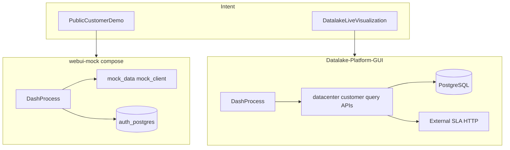

# WebUI: Datalake-Platform-GUI vs datalake-platform-webui-mock

This page summarizes **why two UI repositories exist**, how they differ in **data path and deployment**, and what to keep in sync. Technical drill-down remains in each module’s `docs/` per [ADR-0002](../adrs/ADR-0002-wiki-authoritative-docs-in-module-repos.md); this page adds **code-level facts** that may not be spelled out in module documentation.

## 1. Business intent (primary distinction)

| | **datalake-platform-webui-mock** | **Datalake-Platform-GUI** |
|--|-----------------------------------|---------------------------|
| **Purpose** | **Public-facing customer demo**: share a UI without real tenant data or internal network access; safe for sales and POC. | **Operational visualization**: connect to the **Datalake-backed environment** and **external services** (e.g. SLA HTTP API) to show **live** metrics and inventory. |
| **Runtime model** | **`APP_MODE=mock`**: dashboard data from `mock_client` / `mock_data/` (no datacenter/customer/query APIs). **Auth** matches GUI: [`docker-compose.mock.yml`](../../datalake-platform-webui-mock/docker-compose.mock.yml) runs **`auth-db` + `webui-mock`**; login, RBAC, Settings/IAM, and JWT in `api_client` when not in mock data mode. | **Three FastAPI microservices** + **PostgreSQL** (+ Redis cache in APIs) + Dash `api_client` calling `/api/v1/*`; datacenter service also calls **external** SLA endpoints per topology docs. |
| **Risk / scope** | No production data path in mock-only deploy; branding via `APP_BRAND_TITLE` for demos. | Credentials, JWT to APIs, DB and network access; suitable for staging/production-style environments. |

Minimal **mock data** path is still one Dash process; **compose** for the public demo image is **two** containers (UI + **auth-db**) so sessions and permissions behave like GUI. The **GUI** stack adds **three API** services + datalake DB/Redis when run for real data.

## 2. Technical comparison

| Topic | **Datalake-Platform-GUI** | **datalake-platform-webui-mock** |
|-------|---------------------------|----------------------------------|
| **Data path** | [`src/services/api_client.py`](../../Datalake-Platform-GUI/src/services/api_client.py): **httpx** to microservices; `_auth_headers()` sends **Bearer JWT** when a Flask session user exists. | **Same pattern**: `_is_mock_mode()` → [`mock_client.py`](../../datalake-platform-webui-mock/src/services/mock_client.py); else httpx with `_auth_headers()` (skipped when mock mode). |
| **Mock mode** | **Not present** (no `APP_MODE`, no `mock_data` package). | `APP_MODE=mock`; helper [`src/utils/app_mode.py`](../../datalake-platform-webui-mock/src/utils/app_mode.py) (`is_mock_mode()`). |
| **Authentication** | Full **`src/auth/`** (Flask blueprint, sessions, LDAP/settings, API JWT); [`app.py`](../../Datalake-Platform-GUI/app.py) registers `auth_bp`, migrations, seed. | **Aligned with GUI**: same **`src/auth/`**, login, middleware, permission-aware pages/sidebar; optional **`AUTH_DISABLED=true`** (e.g. tests) impersonates admin when DB is available. |
| **Docker Compose** | Includes **`auth-db`** and auth-related env on `app` ([`docker-compose.yml`](../../Datalake-Platform-GUI/docker-compose.yml)). | [`docker-compose.mock.yml`](../../datalake-platform-webui-mock/docker-compose.mock.yml): **`auth-db`** (host port **5434**) + **`webui-mock`** with `APP_MODE=mock` and auth env vars; optional `app-mock` profile on port 8051 in [`docker-compose.yml`](../../datalake-platform-webui-mock/docker-compose.yml). |
| **Kubernetes** | Full example layout under [`k8s/`](../../Datalake-Platform-GUI/k8s/) (frontend, APIs, redis, ingress, monitoring, auth secrets reference). | Demo-only [`k8s-mock/`](../../datalake-platform-webui-mock/k8s-mock/) — single Deployment (`APP_MODE=mock`), Service, Ingress, ConfigMap. |

## 3. Implementation notes (code vs module docs)

Facts worth capturing in the knowledge base even when not repeated in every `docs/*.md`:

- **JWT to microservices**: Mock `api_client` uses `_auth_headers()` when **`APP_MODE` is not mock**; in **`APP_MODE=mock`**, data comes from `mock_client` and JWT is not attached.
- **Demo + IAM**: Mock `app.py` bootstraps the **auth** database (migrations/seed) like GUI; use **`AUTH_DISABLED=true`** only for controlled dev/test (see mock `.env.example`).
- **Contract parity**: Mock `mock_client` functions mirror public `api_client` entry points so the same Dash pages work; when APIs change, **both** repos must be updated (see below).

## 4. Synchronization checklist

When **`datalake` (core)** or **`project-zabake`** changes an HTTP contract that the UI consumes:

1. Update **Datalake-Platform-GUI**: types, `api_client` usage, and pages under `src/`.
2. Update **datalake-platform-webui-mock**: `mock_data` and [`mock_client.py`](../../datalake-platform-webui-mock/src/services/mock_client.py) to match payloads; extend [`tests/test_mock_mode.py`](../../datalake-platform-webui-mock/tests/test_mock_mode.py) as needed.
3. Keep **feature flags / module permissions** behavior in the **GUI** path when backend JSON drives visibility (see workspace cross-repo rule).

See [[00-Platform-Overview]] — section *Cross-repo API, GUI, and mock synchronization*.

## 5. Authoritative module documentation (do not duplicate here)

| Module | Primary references |
|--------|-------------------|
| **GUI** | [TOPOLOGY_AND_SETUP.md](../../Datalake-Platform-GUI/docs/TOPOLOGY_AND_SETUP.md), [PROJECT_STANDARDS.md](../../Datalake-Platform-GUI/docs/PROJECT_STANDARDS.md), [DOCKER_SETUP.md](../../Datalake-Platform-GUI/docs/DOCKER_SETUP.md) (Turkish quick start → topology), [AUTH_SYSTEM.md](../../Datalake-Platform-GUI/docs/AUTH_SYSTEM.md); environment template: [`.env.example`](../../Datalake-Platform-GUI/.env.example) |
| **WebUI mock** | [TOPOLOGY_AND_SETUP.md](../../datalake-platform-webui-mock/docs/TOPOLOGY_AND_SETUP.md), [KUBERNETES_SETUP.md](../../datalake-platform-webui-mock/docs/KUBERNETES_SETUP.md), [PROJECT_STANDARDS.md](../../datalake-platform-webui-mock/docs/PROJECT_STANDARDS.md) |

## See also

- [[00-Platform-Overview]]
- [[02-Module-Platform-GUI]]
- [[04-Module-WebUI-Mock]]
- [[06-WebUI-Data-Lineage]] — route-to-table mapping for the live (non-mock) data path
- [[99-Glossary-And-Legacy-Names]]
