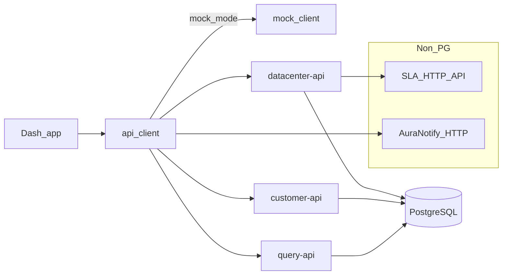

# WebUI data lineage (twin repos → APIs → PostgreSQL)

This page maps **Dash routes and panels** in **Datalake-Platform-GUI** and **datalake-platform-webui-mock** to **`api_client` functions**, **HTTP APIs**, and **primary `public.*` tables** in the Datalake PostgreSQL database. It complements [[05-WebUI-GUI-vs-Mock]] (runtime intent) and [[datalake-collectors/00-Index]] (collector → table ownership).

**Convention:** Both repositories share the same Dash layout and `src/services/api_client.py` contract. In **datalake-platform-webui-mock**, `APP_MODE=mock` routes most calls to [`mock_client.py`](../../datalake-platform-webui-mock/src/services/mock_client.py) (static [`mock_data/`](../../datalake-platform-webui-mock/src/services/mock_data/)); the **PostgreSQL mapping below applies to the live (non-mock) path** and to the **parallel `services/*-api`** code kept in both repos.

Authoritative topology: [`TOPOLOGY_AND_SETUP.md`](../../Datalake-Platform-GUI/docs/TOPOLOGY_AND_SETUP.md). S3 UI rules: [`PROJECT_STANDARDS.md`](../../Datalake-Platform-GUI/docs/PROJECT_STANDARDS.md).

---

## 1. Twin repos and route parity

| Area | Datalake-Platform-GUI | datalake-platform-webui-mock |
|------|------------------------|-------------------------------|
| Auth / settings | `/login`, `/settings/*`, RBAC via `src/auth/` | No auth stack; no `/settings` |
| DC rack drill-down | `/dc-detail/{dc}` → [`dc_detail.py`](../../Datalake-Platform-GUI/src/pages/dc_detail.py) (`get_dc_racks`, `get_dc_details`) | **Not registered** in [`app.py`](../../datalake-platform-webui-mock/app.py) |
| Mock-only demo pages | — | `/analytics` (static mock generators), `/daa` (canned assistant replies), only when `is_mock_mode()` |

Shared routes (both): `/`, `/datacenters`, `/datacenter/{id}`, `/global-view`, `/customer-view`, `/query-explorer`, `/region-drilldown` (placeholder UI).

---

## 2. Route → `api_client` → service → HTTP path

| Route / page builder | Primary `api_client` entry points | Service | Example `/api/v1` paths |
|----------------------|-----------------------------------|---------|-------------------------|
| `/` [`home.py`](../../Datalake-Platform-GUI/src/pages/home.py) | `get_global_dashboard`, `get_all_datacenters_summary`, `get_physical_inventory_overview_by_role` | datacenter-api | `/dashboard/overview`, `/datacenters/summary`, `/physical-inventory/overview/by-role` |
| `/datacenters` [`datacenters.py`](../../Datalake-Platform-GUI/src/pages/datacenters.py) | `get_all_datacenters_summary`, `get_sla_by_dc` | datacenter-api | `/datacenters/summary`, `/sla` |
| `/datacenter/{id}` [`dc_view.py`](../../Datalake-Platform-GUI/src/pages/dc_view.py) | `get_dc_details`, `get_sla_by_dc`, `get_dc_s3_pools`, cluster lists, `get_classic_metrics_filtered` / `get_hyperconv_metrics_filtered`, backup trio, SAN, network, IBM storage capacity/perf, Zabbix Intel storage, `get_physical_inventory_dc`, `get_dc_availability_sla_item` | datacenter-api | `/datacenters/{dc}`, `/sla`, `/datacenters/{dc}/s3/pools`, `/datacenters/{dc}/compute/*`, `/datacenters/{dc}/backup/*`, `/datacenters/{dc}/san/*`, `/datacenters/{dc}/network/*`, `/datacenters/{dc}/storage/*`, `/datacenters/{dc}/zabbix-storage/*`, `/datacenters/{dc}/physical-inventory` |
| `/global-view` [`global_view.py`](../../Datalake-Platform-GUI/src/pages/global_view.py) | `get_all_datacenters_summary`, `get_dc_details` | datacenter-api | `/datacenters/summary`, `/datacenters/{dc}` |
| `/customer-view` [`customer_view.py`](../../Datalake-Platform-GUI/src/pages/customer_view.py) | `get_customer_resources`, `get_customer_s3_vaults`, `get_physical_inventory_customer`, `get_customer_availability_bundle` | customer-api + datacenter-api + in-process | `/customers/{name}/resources`, `/customers/{name}/s3/vaults`, `/physical-inventory/customer`; AuraNotify via [`auranotify_client`](../../Datalake-Platform-GUI/src/services/auranotify_client.py) |
| `/query-explorer` [`query_explorer.py`](../../Datalake-Platform-GUI/src/pages/query_explorer.py) | `execute_registered_query` | query-api | `/queries/{query_key}?params=…` |
| `/dc-detail/{id}` [`dc_detail.py`](../../Datalake-Platform-GUI/src/pages/dc_detail.py) | `get_dc_racks`, `get_rack_devices`, `get_dc_details` | datacenter-api | `/datacenters/{dc}/racks`, `/datacenters/{dc}/racks/{rack}/devices`, `/datacenters/{dc}` |

Startup (both): [`app.py`](../../Datalake-Platform-GUI/app.py) calls `get_customer_list()` → customer-api **`GET /customers`**.

---

## 3. Domain → primary PostgreSQL tables (live path)

Use this as a **high-level** map. Exact SQL lives under [`services/datacenter-api/app/db/queries/`](../../Datalake-Platform-GUI/services/datacenter-api/app/db/queries/) and [`services/customer-api/app/db/queries/`](../../Datalake-Platform-GUI/services/customer-api/app/db/queries/). Dynamic query keys: [`registry.py`](../../Datalake-Platform-GUI/services/query-api/app/db/queries/registry.py) (same registry pattern in datacenter-api’s explorer).

| Domain | Primary tables (indicative) | Query / service references |
|--------|------------------------------|----------------------------|
| Global / DC overview & VMware/Nutanix/IBM rollups | `nutanix_cluster_metrics`, `datacenter_metrics`, `ibm_server_general`, `ibm_vios_general`, `ibm_lpar_general`, `vmhost_metrics`, `ibm_server_power` | Batch logic in [`dc_service.py`](../../Datalake-Platform-GUI/services/datacenter-api/app/services/dc_service.py); registry keys in [`registry.py`](../../Datalake-Platform-GUI/services/datacenter-api/app/db/queries/registry.py) |
| Customer compute assets | `vm_metrics`, `nutanix_vm_metrics`, `ibm_lpar_general`, `ibm_vios_general`, `ibm_server_general` (see file header) | [`customer.py`](../../Datalake-Platform-GUI/services/customer-api/app/db/queries/customer.py) |
| Customer backup summary | `raw_veeam_sessions`, `raw_zerto_vpg_metrics`, `raw_netbackup_jobs_metrics` | Same [`customer.py`](../../Datalake-Platform-GUI/services/customer-api/app/db/queries/customer.py) |
| DC / customer S3 | `raw_s3icos_pool_metrics`, `raw_s3icos_vault_metrics`, `raw_s3icos_vault_inventory` | [`s3.py`](../../Datalake-Platform-GUI/services/datacenter-api/app/db/queries/s3.py) |
| DC backup panels | `raw_netbackup_disk_pools_metrics`, `raw_zerto_site_metrics`, `raw_veeam_repositories_states` | [`backup.py`](../../Datalake-Platform-GUI/services/datacenter-api/app/db/queries/backup.py), [`dc_service.py`](../../Datalake-Platform-GUI/services/datacenter-api/app/services/dc_service.py) |
| SAN (Brocade) | `raw_brocade_san_fcport_1` and related Brocade queries | [`brocade.py`](../../Datalake-Platform-GUI/services/datacenter-api/app/db/queries/brocade.py) |
| Network dashboard (Zabbix) | `zabbix_network_device_metrics`, `zabbix_network_interface_metrics`, joined via `discovery_netbox_inventory_device` | [`zabbix_network.py`](../../Datalake-Platform-GUI/services/datacenter-api/app/db/queries/zabbix_network.py) |
| IBM Power Storage (capacity / performance) | `raw_ibm_storage_system`, `raw_ibm_storage_system_stats` | [`ibm_storage.py`](../../Datalake-Platform-GUI/services/datacenter-api/app/db/queries/ibm_storage.py), [`dc_service.py`](../../Datalake-Platform-GUI/services/datacenter-api/app/services/dc_service.py) `get_storage_capacity` / `get_storage_performance` |
| Intel / Zabbix storage UI | `zabbix_storage_device_metrics`, `zabbix_storage_disk_metrics`, `loki_locations`, `discovery_netbox_inventory_device` | [`zabbix_storage.py`](../../Datalake-Platform-GUI/services/datacenter-api/app/db/queries/zabbix_storage.py) |
| Physical inventory | `discovery_netbox_inventory_device` | [`dc_service.py`](../../Datalake-Platform-GUI/services/datacenter-api/app/services/dc_service.py), [`customer.py`](../../Datalake-Platform-GUI/services/customer-api/app/db/queries/customer.py) |
| Racks (GUI-only route) | `discovery_loki_rack`, `discovery_loki_location`, `loki_devices` | [`discovery_rack.py`](../../Datalake-Platform-GUI/services/datacenter-api/app/db/queries/discovery_rack.py) |
| Query Explorer | All keys in `QUERY_REGISTRY` | [`registry.py`](../../Datalake-Platform-GUI/services/query-api/app/db/queries/registry.py) |

**Collector alignment:** For which ingest pipeline fills each table, see [[datalake-collectors/00-Index]].

---

## 4. How data is presented (technical)

- **Time range:** `app-time-range` store (`preset` or custom `start`/`end`) is passed into `api_client` as `_build_time_params` and forwarded as query parameters to APIs.
- **DC-scoped panels:** Under `/datacenter/{id}`, callbacks read `pathname`, resolve `dc_id`, then call the matching `get_*` (e.g. S3 pool chips in [`app.py`](../../Datalake-Platform-GUI/app.py) `update_s3_dc_panel`).
- **S3:** Pool/vault chip selectors default to all; see [`PROJECT_STANDARDS.md`](../../Datalake-Platform-GUI/docs/PROJECT_STANDARDS.md) §4–5.
- **Compute:** Classic vs hyperconverged tabs use cluster multi-select; data from `/datacenters/{dc}/compute/classic` and `.../hyperconverged`.
- **Exports / tables:** Customer view builds CSV/Excel/PDF from in-memory structures (see [`customer_view.py`](../../Datalake-Platform-GUI/src/pages/customer_view.py)).

---

## 5. Exceptions (not plain PostgreSQL via microservices)

| Item                                                                                | Behavior                                                                                                                                                                                                                        |
| ----------------------------------------------------------------------------------- | ------------------------------------------------------------------------------------------------------------------------------------------------------------------------------------------------------------------------------- |
| **SLA availability (`get_sla_by_dc`)**                                              | datacenter-api [`sla_service.py`](../../Datalake-Platform-GUI/services/datacenter-api/app/services/sla_service.py) calls **external HTTP** `SLA_API_URL`, with Redis-backed cache — **not** a Datalake table.                   |
| **AuraNotify (`get_customer_availability_bundle`, `get_dc_availability_sla_item`)** | [`auranotify_client.py`](../../Datalake-Platform-GUI/src/services/auranotify_client.py) — **external HTTP**; mock returns static payloads from [`mock_client`](../../datalake-platform-webui-mock/src/services/mock_client.py). |
| **Query Explorer in mock**                                                          | [`mock_client.execute_registered_query`](../../datalake-platform-webui-mock/src/services/mock_client.py) returns a **fixed stub table**; no `query-api` round-trip.                                                             |
| **Mock-only `/analytics`, `/daa`**                                                  | Static / canned content in [`analytics.py`](../../datalake-platform-webui-mock/src/pages/analytics.py), [`daa.py`](../../datalake-platform-webui-mock/src/pages/daa.py) — **no** datalake mapping.                              |

---

## See also

- [[05-WebUI-GUI-vs-Mock]]
- [[02-Module-Platform-GUI]]
- [[04-Module-WebUI-Mock]]
- [[01-Module-Datalake-Core]]
- [[datalake-collectors/00-Index]]
- [[00-Platform-Overview]]
